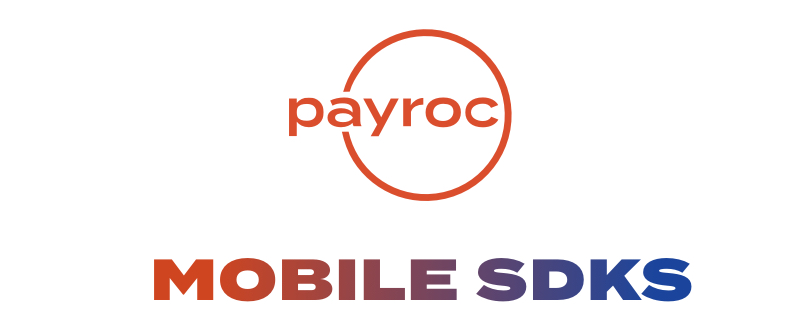
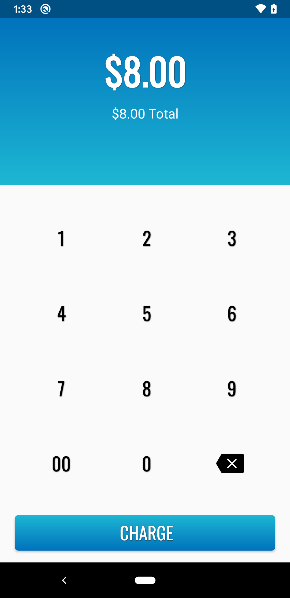
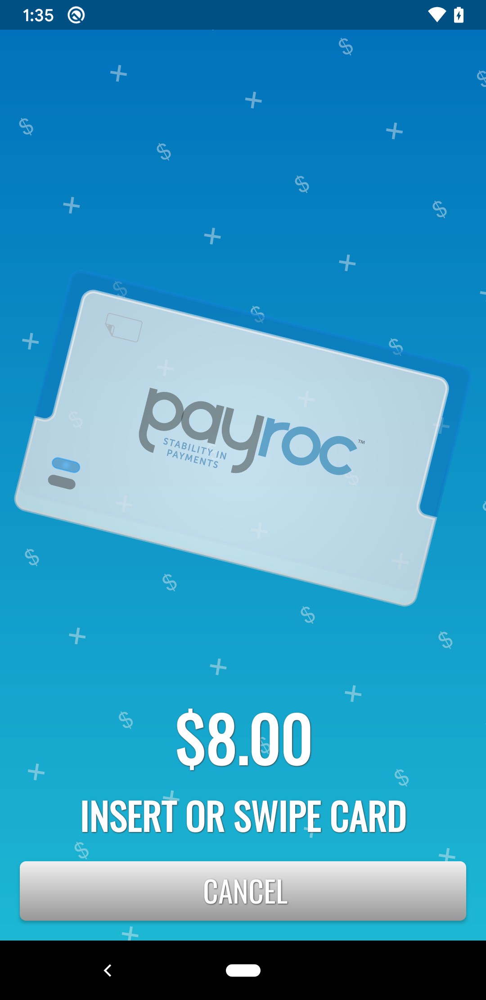
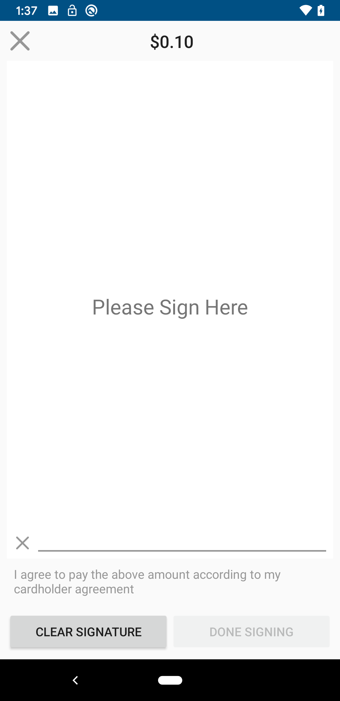

Made with ❤️ by [Payroc LLC](https://www.payroc.com).

## Overview

<table>
  <tr>
    <th>
      
    </th>
    <th>
      
    </th>
    <th>
    
    </th>
  </tr>
</table>

GIFs COMING SOON! STAY TUNED!

## Getting Started

These instructions will get the SDK installed and running on your local machine for development and testing purposes within your mobile application. See deployment for notes on how to deploy the project on a live system.

Ready to get started? Docs for each supported platform are found [here](https://github.com/payroc/mobile_sdks/wiki)

## Versioning

We use [SemVer](http://semver.org/) for versioning on all projects. For the versions available, see the [tags on this repository](https://github.com/payroc/mobile_sdk/tags). 

## Authors

* **Preston Farr** - *Lead Mobile Developer* - [Payroc](https://github.com/payroc)

See also the list of [contributors](https://github.com/payroc/mobile_sdk/contributors) who participated in this project.

## Acknowledgments

* [DSpread](https://gitlab.com/dspread) - MPOS SDK Provider for EMV Bluetooth Hardware 
 
